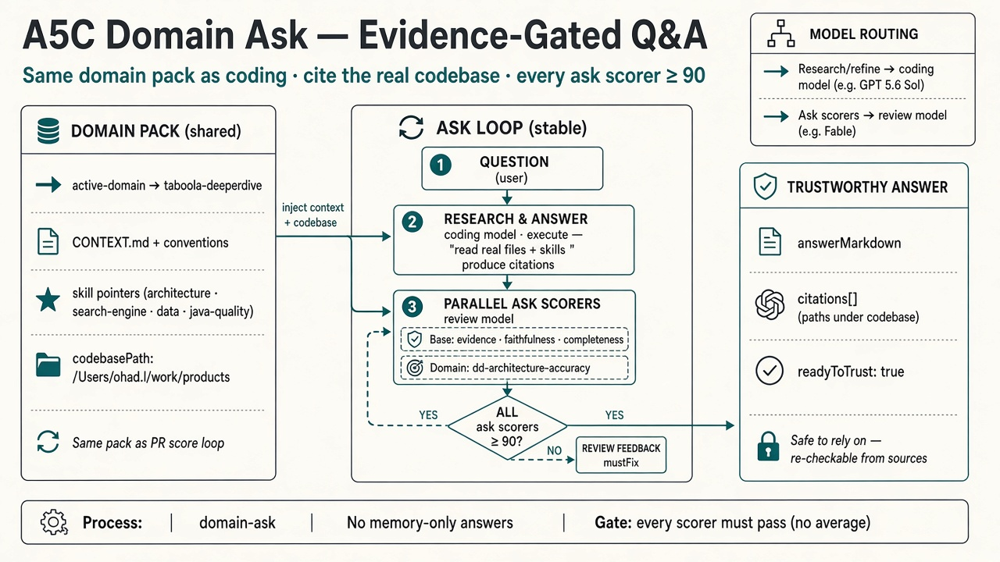
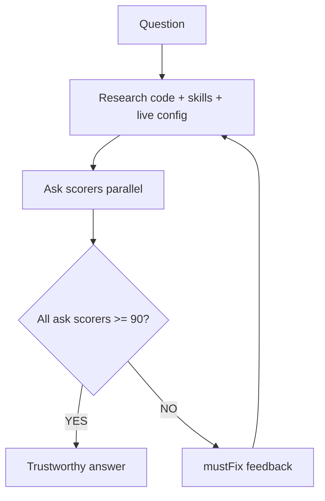

# A5C Domain Ask — Evidence-Gated Q&A

**One-liner:** Same domain pack as coding · cite the real codebase · every ask scorer ≥ 90.

## Flow

## Ask scorers

| Layer | Scorers |
|-------|---------|
| Base | evidence · faithfulness · completeness · live-config |
| Domain | overlays from `domains/<id>/ask-scorers.json` |

**Live config:** optional pack `config-sources.json`. Flag-gated claims need `configLookups` + `db:` citations — code defaults alone fail `live-config`.

## Related

- Process: [`.a5c/core/processes/domain-ask.js`](../.a5c/core/processes/domain-ask.js)
- Runbook: [`.a5c/processes/README.md`](../.a5c/processes/README.md)
- Code loop diagram: [`a5c-pr-score-loop-hld-v3.png`](./a5c-pr-score-loop-hld-v3.png)
- Scorers diagram: [`a5c-scorers-hld.png`](./a5c-scorers-hld.png)
