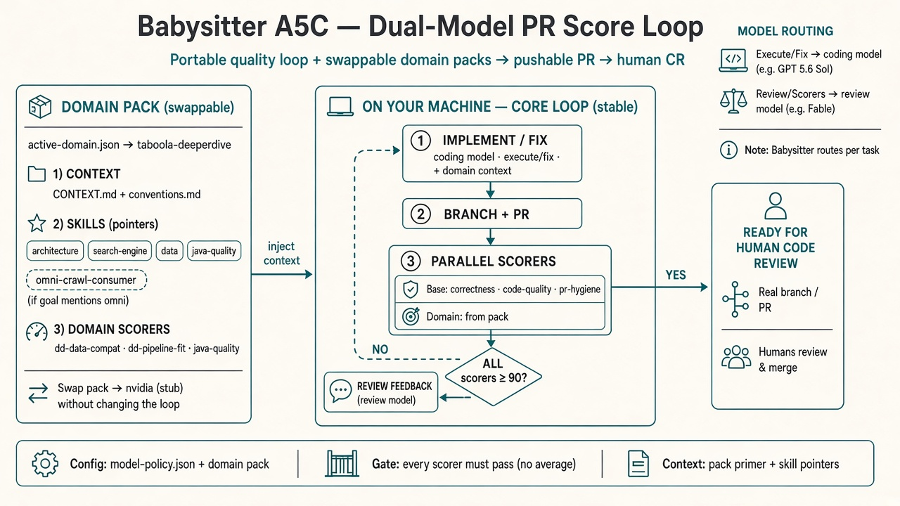
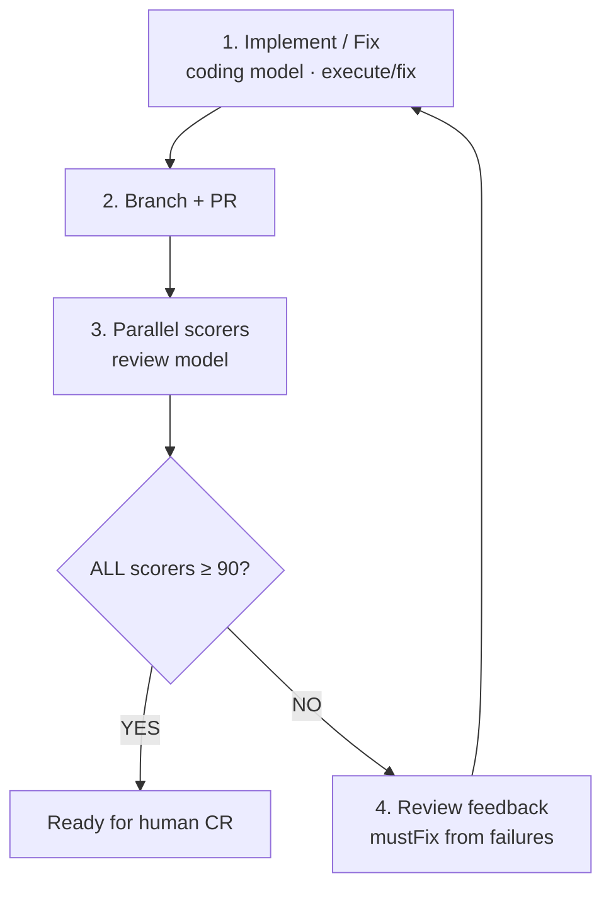

# Babysitter A5C — Dual-Model PR Score Loop

**One-liner:** Portable quality loop + swappable domain packs → pushable PR → human code review.

## Flow

## Locked decisions

| Topic | Choice |
|-------|--------|
| Where it runs | Your machine (babysitter / A5C only) |
| Models | Execute/fix = coding model · Review/scorers = review model |
| Gate | **Every** scorer ≥ 90 (no average) |
| Output | Real branch / PR for **human** review & merge |
| Config | `model-policy.json` + domain packs under `.a5c/domains/` |

## Plug-and-play domains

Core loop is fixed. Swap **context + scorers** via `.a5c/active-domain.json`:

- Copy `domains/_template` → `domains/<your-id>`
- Fill CONTEXT, conventions, skill pointers, optional domain scorers / config-sources

See [`.a5c/processes/README.md`](../.a5c/processes/README.md).

## Starter scorers

**Base (always):** correctness · code-quality · pr-hygiene  

**Domain:** whatever you declare in `domains/<id>/scorers.json`

Gate: **every** scorer ≥ 90 (no average).
