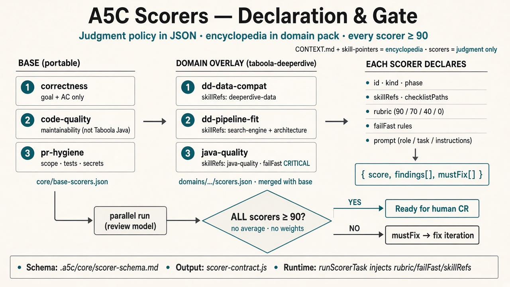

# A5C Scorers — Declaration & Gate

**One-liner:** Judgment policy in JSON · encyclopedia in the domain pack · every scorer ≥ 90 (no average).

## Layers

| Layer | Scorers | File |
|-------|---------|------|
| Base (portable) | correctness · code-quality · pr-hygiene | `.a5c/core/base-scorers.json` |
| Domain | your overlays | `.a5c/domains/<id>/scorers.json` |

Ask mode uses `.a5c/core/ask-scorers.json` + `domains/<id>/ask-scorers.json`.

## Each scorer declares

`id` · `kind` · `phase` · `skillRefs` · `checklistPaths` · `rubric` · `failFast` · `prompt`

**Output:** `{ score, findings[], mustFix[] }`

## Schema

See [`.a5c/core/scorer-schema.md`](../.a5c/core/scorer-schema.md).
